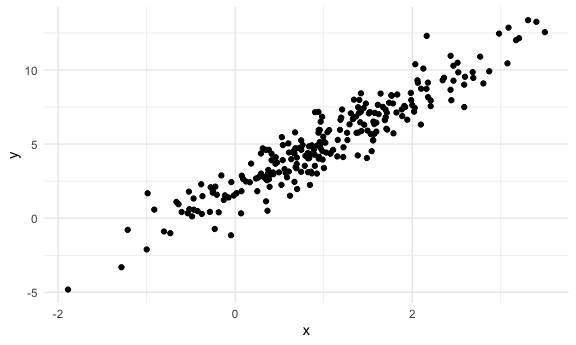
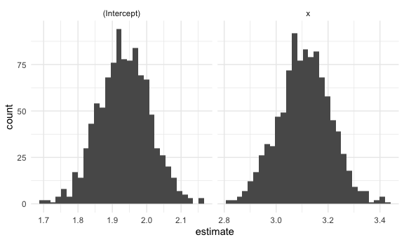
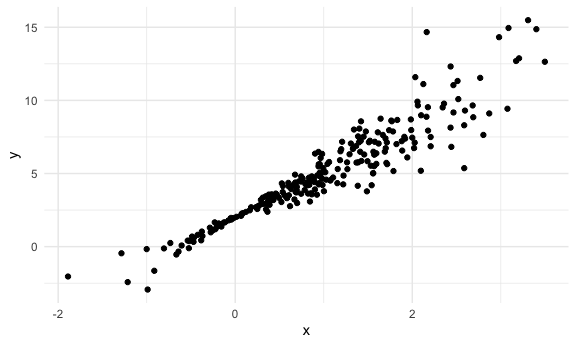
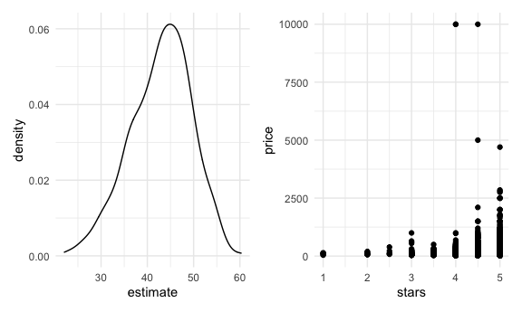

Bootstrapping
================

## Simulate aa dataset

``` r
set.seed(1)

n_samp = 250

sim_df_const = 
  tibble(
    x = rnorm(n_samp, 1, 1),
    error = rnorm(n_samp, 0, 1),
    y = 2 + 3 * x + error
  )

sim_df_nonconst = sim_df_const %>% 
  mutate(
  error = error * .75 * x,
  y = 2 + 3 * x + error
)
```

Make a plot

``` r
sim_df_const %>% 
  ggplot(aes(x = x, y = y)) + 
  geom_point()
```



``` r
sim_df_nonconst %>% 
  lm(y ~ x, data = .) %>% 
  broom::tidy()
```

    ## # A tibble: 2 × 5
    ##   term        estimate std.error statistic   p.value
    ##   <chr>          <dbl>     <dbl>     <dbl>     <dbl>
    ## 1 (Intercept)     1.93    0.105       18.5 1.88e- 48
    ## 2 x               3.11    0.0747      41.7 5.76e-114

## Let’s try to use bootstrap for inference

``` r
bootstrap_sample <-   
  sim_df_nonconst %>% 
  sample_frac(size = 1, replace = TRUE) %>% 
  arrange(x)

lm(y ~ x, data = bootstrap_sample)
```

    ## 
    ## Call:
    ## lm(formula = y ~ x, data = bootstrap_sample)
    ## 
    ## Coefficients:
    ## (Intercept)            x  
    ##       1.897        3.196

Let’s write a function …

``` r
boot_sample <- function(df) {
  
  sample_frac(df, size = 1, replace = TRUE)
}
```

Now, we’ll make a tibble to keep track of everything.

``` r
boot_strap_df <- 
  tibble(
    strap_number = 1:1000,
    strap_sample = rerun(1000, boot_sample(sim_df_nonconst))
  )
```

From here … things are kinda the same as “always”

``` r
bootstrap_results <- 
  boot_strap_df %>% 
  mutate(
    models = map(.x = strap_sample, ~lm(y ~ x, data = .x)),
    results = map(models, broom::tidy)
  ) %>% 
  select(strap_number, results) %>% 
  unnest(results)

bootstrap_results %>% 
  ggplot(aes(x = estimate)) + 
  geom_histogram() + 
  facet_grid(~ term, scales = "free")
```



``` r
# lm function assumes constant variances everywhere, but it's not
lm(y ~ x, data = sim_df_nonconst) %>% 
  broom::tidy()
```

    ## # A tibble: 2 × 5
    ##   term        estimate std.error statistic   p.value
    ##   <chr>          <dbl>     <dbl>     <dbl>     <dbl>
    ## 1 (Intercept)     1.93    0.105       18.5 1.88e- 48
    ## 2 x               3.11    0.0747      41.7 5.76e-114

``` r
# Plot shows the variances are not constant
sim_df_nonconst %>% 
  ggplot(aes(x = x, y = y)) + 
  geom_point()
```



``` r
# So below standard errors are better to use
bootstrap_results %>% 
  group_by(term) %>% 
  summarize(
    se = sd(estimate)
  )
```

    ## # A tibble: 2 × 2
    ##   term            se
    ##   <chr>        <dbl>
    ## 1 (Intercept) 0.0747
    ## 2 x           0.101

What about the constant sample?

``` r
boot_strap_df <- 
  tibble(
    strap_number = 1:1000,
    strap_sample = rerun(1000, boot_sample(sim_df_const))
  )

bootstrap_results <- 
  boot_strap_df %>% 
  mutate(
    models = map(.x = strap_sample, ~lm(y ~ x, data = .x)),
    results = map(models, broom::tidy)
  ) %>% 
  select(strap_number, results) %>% 
  unnest(results)

# Compare lm results with the bootstrap results
# Two approaches below are similar
lm(y ~ x, data = sim_df_const) %>% 
  broom::tidy()
```

    ## # A tibble: 2 × 5
    ##   term        estimate std.error statistic   p.value
    ##   <chr>          <dbl>     <dbl>     <dbl>     <dbl>
    ## 1 (Intercept)     1.98    0.0981      20.2 3.65e- 54
    ## 2 x               3.04    0.0699      43.5 3.84e-118

``` r
bootstrap_results %>% 
  group_by(term) %>% 
  summarize(
    se = sd(estimate)
  )
```

    ## # A tibble: 2 × 2
    ##   term            se
    ##   <chr>        <dbl>
    ## 1 (Intercept) 0.0984
    ## 2 x           0.0721

## Use `modelr`

``` r
sim_df_nonconst %>% 
  bootstrap(n = 1000, id = "strap_number") %>% 
  mutate(
    models = map(.x = strap, ~lm(y ~ x, data = .x)),
    results = map(models, broom::tidy)
  ) %>% 
  select(strap_number, results) %>% 
  unnest(results)
```

    ## # A tibble: 2,000 × 6
    ##    strap_number term        estimate std.error statistic   p.value
    ##    <chr>        <chr>          <dbl>     <dbl>     <dbl>     <dbl>
    ##  1 0001         (Intercept)     2.02    0.116       17.4 6.38e- 45
    ##  2 0001         x               2.97    0.0778      38.2 7.23e-106
    ##  3 0002         (Intercept)     1.82    0.0923      19.8 7.82e- 53
    ##  4 0002         x               3.07    0.0659      46.5 1.90e-124
    ##  5 0003         (Intercept)     1.90    0.104       18.2 1.07e- 47
    ##  6 0003         x               3.09    0.0756      40.9 3.22e-112
    ##  7 0004         (Intercept)     2.01    0.114       17.6 2.16e- 45
    ##  8 0004         x               3.15    0.0760      41.5 1.15e-113
    ##  9 0005         (Intercept)     1.89    0.113       16.8 7.93e- 43
    ## 10 0005         x               3.30    0.0765      43.1 3.07e-117
    ## # … with 1,990 more rows

## Airbnb

``` r
data("nyc_airbnb")

nyc_airbnb <- 
  nyc_airbnb %>% 
  mutate(stars = review_scores_location / 2) %>% 
  rename(
    borough = neighbourhood_group
  ) %>% 
  filter(borough != "Staten Island") %>% 
  select(price, stars, borough, room_type)
```

``` r
nyc_airbnb %>% 
  ggplot(aes(x = stars, y = price)) + 
  geom_point()
```


``` r
airbnb_bootstrap_results <- 
  nyc_airbnb %>% 
  filter(borough == "Manhattan") %>% 
  bootstrap(n = 1000, id = "strap_number") %>% 
  mutate(
    models = map(.x = strap, ~lm(price ~ stars, data = .x)),
    results = map(models, broom::tidy)
  ) %>% 
  select(strap_number, results) %>% 
  unnest(results)


ggp_star_est <- 
  airbnb_bootstrap_results %>% 
  filter(term == "stars") %>% 
  ggplot(aes(estimate)) +
  geom_density()
  ggplot()
```


``` r
ggp_scatter <- 
  nyc_airbnb %>% 
  filter(borough == "Manhattan") %>% 
  ggplot(aes(x = stars, y = price)) + 
  geom_point()

ggp_star_est + ggp_scatter
```


